<picture>
  <source media="(prefers-color-scheme: dark)" srcset="assets/banner-dark.svg">
  <source media="(prefers-color-scheme: light)" srcset="assets/banner-light.svg">
  
</picture>

I build production systems end to end — API contracts, typed services, UI, and the pipelines that ship them. Lately that means AI-backed products: agent orchestration, retrieval over real corpora, and a hard line between what a model may decide and what plain code must enforce. I care more about systems you can reason about than clever ones — explicit state machines, clear domain boundaries, and tests that catch real regressions.

AWS Certified Solutions Architect – Associate.

### Featured Projects

| Project | What it is | Stack |
| --- | --- | --- |
| **[WeekForge](https://github.com/Zoeyyhc/weekforge)** · [live](https://www.weekforge.site/) | Four agents with deliberately conflicting objectives debate your week in the open — and when they stall, you arbitrate. Deterministic validation enforces the wall clock while the agents argue about what's best. | CrewAI · LangGraph · FastAPI · SSE · Next.js |
| **[Vera — Cervical Health Navigator](https://github.com/Zoeyyhc/vera-cervical-health)** · [live](https://cervix-assistant.vercel.app/) | A non-diagnostic health navigator over a curated public-health corpus, with a pipeline that finds its own retrieval gaps and closes them under human review. | Claude · pgvector · Supabase · Next.js · TypeScript |
| **[SWE-Arena](https://github.com/BigComputer-Project/SWE-Arena)** · [live](https://swe-arena.com) | Open-source platform for benchmarking LLM-generated code — several models answer the same task and every solution runs in an isolated sandbox, so the comparison is objective. *Frontend lead & E2B integration.* | Python · Gradio · E2B · FastChat |
| **[Marketing Simplified](https://github.com/quanwangniuniu/mediaJira)** | Marketing operations platform — Kafka domain events across the system, FSM-driven approval workflows, real-time collaboration over WebSockets. *Full stack developer.* | Django · Kafka · PostgreSQL · Next.js |

### Tech

<picture>
  <source media="(prefers-color-scheme: dark)" srcset="assets/tech-dark.svg">
  <source media="(prefers-color-scheme: light)" srcset="assets/tech-light.svg">
  
</picture>

### Contact

[LinkedIn](https://www.linkedin.com/in/yuhan-zoey-cao/) · [zoeycao99@gmail.com](mailto:zoeycao99@gmail.com)

Open to software engineering roles in Melbourne.

<picture>
  <source media="(prefers-color-scheme: dark)" srcset="https://raw.githubusercontent.com/Zoeyyhc/Zoeyyhc/output/snake-dark.svg">
  <source media="(prefers-color-scheme: light)" srcset="https://raw.githubusercontent.com/Zoeyyhc/Zoeyyhc/output/snake-light.svg">
  
</picture>

The banner is regenerated on a schedule — it shows the real date and season in Melbourne, and takes its accent colour from the local time of day. Source: <a href="scripts/gen_assets.py"><code>scripts/gen_assets.py</code></a>.
